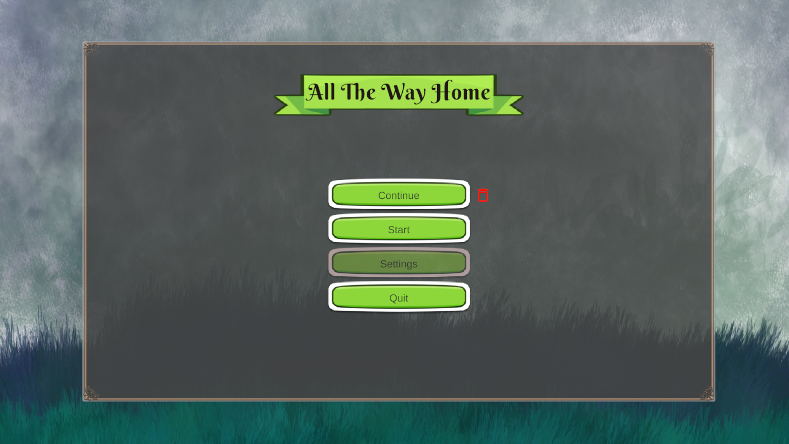
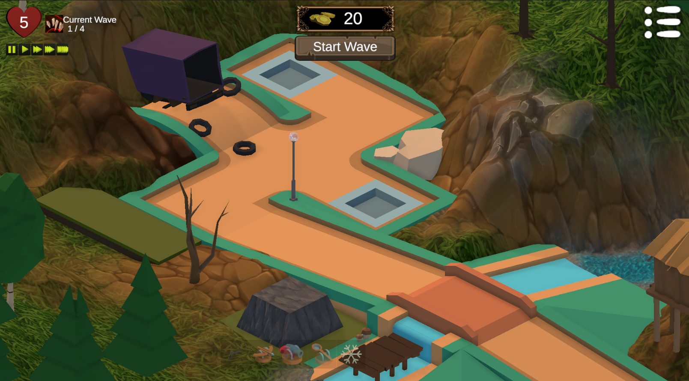
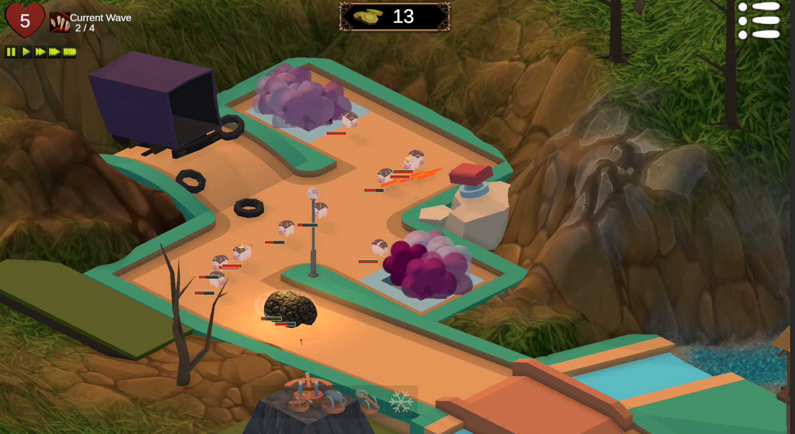
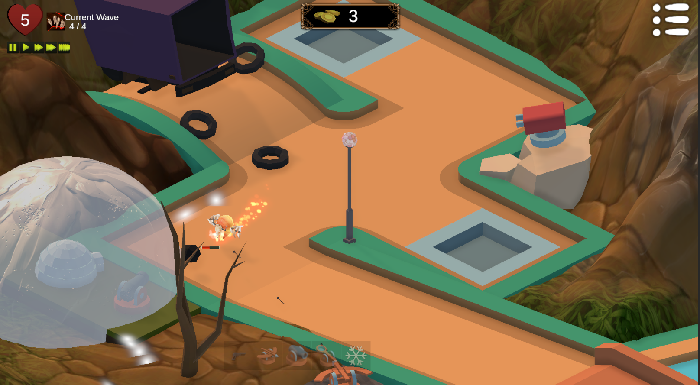

# "All The Way Home"

## Highlights

## Pending Items

### Design

o More than one Level design
o Tutorial type map 

### Functionality

~ Unlock Towers / career panel?

### Appearance

o More Unified theme / look?
o FX
	x Fix the toonFx as most do not render in game view
		x have to change the material / shader for the material 
	o Audio
		x Background Music?
		o Improved tower FX?
		o Hurt audio?
		o Boss sounds

### Features

#### Project Features

o Photosensitive warning
o Testing
o No animals harmed in making! (cuz of the pigs)

#### Game Features

x Wave wait / send early fix (partially implemented but regression)
o Cut Scene?
	- Opening has that truck driving with the pigs in the back, once crashed they start to spawn
	  - Then the golems & boss were those who were annoyed/ affected by the crash and awoke
o Revisit the Tower Upgrade UI 
o Rebalance the cost / Upgrade / Range / Selling ratios
=> Also, the unit scaling does not allow for clean upgrade jumps by %

#### Enemy Features

o Enemy upgrade Gates
	=> As the enemies pass through the gates throughout the level, they either get stronger, buff nearby allies, or similar (speed up?)
o Enemy oil slick / speed buff
	=> Partly implemented; the buff currently created is a bit too hardcoded and needs some refactoring
o units attack / disable / destroy towers? perhaps when they die too close to them 
  or certain enemies will "explode"
o Enemy Kill Fx / Drop Animation?
o Enemy hover Selection?

## Additional Notes

o Spawner Fix
	- Attempting to resolve the player vs autostart feature wound up causing some bugs over time, untangling some of it has lead to this not quite working atm.
	o Consider changing this all to state machine...

### Screens / Menus TODOs
o Upgrade Menu
=> Perk selection instead
o Scene Transitions
o Controls ?
o Improved Build Bar UI
o 